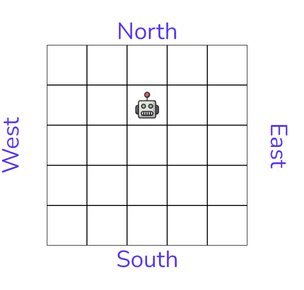

<div id="top"></div>
<!--
*** Thanks for checking out the Best-README-Template. If you have a suggestion
*** that would make this better, please fork the repo and create a pull request
*** or simply open an issue with the tag "enhancement".
*** Don't forget to give the project a star!
*** Thanks again! Now go create something AMAZING! :D
-->


<!-- PROJECT SHIELDS -->
<!--
*** I'm using markdown "reference style" links for readability.
*** Reference links are enclosed in brackets [ ] instead of parentheses ( ).
*** See the bottom of this document for the declaration of the reference variables
*** for contributors-url, forks-url, etc. This is an optional, concise syntax you may use.
*** https://www.markdownguide.org/basic-syntax/#reference-style-links
-->
[![LinkedIn][linkedin-shield]][linkedin-url]


<!-- PROJECT LOGO -->
<br />
<div align="center">
  <a href="https://github.com/othneildrew/Best-README-Template">
    
  </a>

  <h3 align="center">Mr Yum Toy Robot</h3>

  <p align="center">
    An awesome robot simulator
  </p>
</div>


<!-- TABLE OF CONTENTS -->
<details>
  <summary>Table of Contents</summary>
  <ol>
    <li>
      <a href="#about-the-project">About The Project</a>
      <ul>
        <li><a href="#built-with">Built With</a></li>
      </ul>
    </li>
    <li>
      <a href="#getting-started">Getting Started</a>
      <ul>
        <li><a href="#prerequisites">Prerequisites</a></li>
        <li><a href="#installation">Installation</a></li>
      </ul>
    </li>
    <li><a href="#usage">Usage</a></li>
  </ol>
</details>


<!-- ABOUT THE PROJECT -->
## About The Project

<br/>

**LIVE DEMO** - [mr-yum-toy-robot.web.app](https://mr-yum-toy-robot.web.app/)

<br/>

[![Product Name Screen Shot][product-screenshot]](https://mr-yum-toy-robot.web.app/)

This application is a simulation of a toy robot moving on a square tabletop, of dimensions 5 units x 5 units.

Project specifications can be found <a href="./MrYum_Toy_Robot_Simulator.pdf">here</a>


<p align="right">(<a href="#top">back to top</a>)</p>


### Built With


* [React.js](https://reactjs.org/)
* [Typescript](https://www.typescriptlang.org/)
* [Material-ui](https://mui.com/)
* [Formik](https://formik.org/)
* [React-konva](https://konvajs.org/docs/react/index.html)
* [Cypress](https://www.cypress.io/)
* [React Testing Library](https://testing-library.com/)


<p align="right">(<a href="#top">back to top</a>)</p>


<!-- GETTING STARTED -->
## Getting Started

### Prerequisites

* yarn
  ```sh
  npm install yarn -g
  ```

### Installation

1. Clone the repo
   ```sh
   git clone https://github.com/LyleClassen/MrYumToyRobot.git
   ```
2. Install Yarn packages
   ```sh
   yarn
   ```

<p align="right">(<a href="#top">back to top</a>)</p>


<!-- USAGE EXAMPLES -->
## Usage

### Run application locally:
   ```sh
  yarn start
   ```
### Run Tests:
 1. React Testing Library/Jest
 ```sh
  yarn test
   ```
  2. Cypress:
  ```sh
  yarn test:cypress
  ```
  Wait for server to finishing launching before running Cypress tests.
  Then click the run button as seen below:
  ![Cypress Screen Shot][cypress-screenshot]


<p align="right">(<a href="#top">back to top</a>)</p>


<!-- CONTACT -->
## Contact

Lyle Classen - [@lyle_classen](https://twitter.com/your_username) - classenlyle@gmail.com

Project Link: [https://github.com/LyleClassen/MrYumToyRobot](https://github.com/LyleClassen/mr-yum-toy-robot)

<p align="right">(<a href="#top">back to top</a>)</p>


<!-- MARKDOWN LINKS & IMAGES -->
<!-- https://www.markdownguide.org/basic-syntax/#reference-style-links -->
[linkedin-shield]: https://img.shields.io/badge/-LinkedIn-black.svg?style=for-the-badge&logo=linkedin&colorB=555
[linkedin-url]: https://www.linkedin.com/in/lyle-classen/
[product-screenshot]: images/site-screenshot.png
[cypress-screenshot]: images/cypress.png
